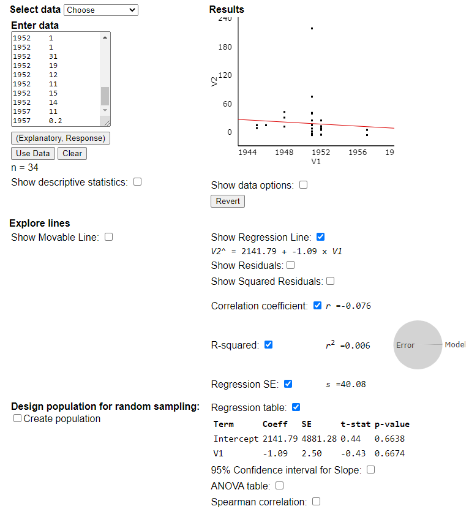

### Rohan Bandaru

## Step 1
```{r}
dat = read.table("nuclear_explosions.csv", header=T, sep=",")
dat = dat[1:dim(dat)[1]-1,]

tab1 = table(dat[,4])
tab1_exp = rep(sum(tab1)/dim(tab1), dim(tab1))

disp_table = rbind(tab1, tab1_exp)
rownames(disp_table) = c("Observed", "Expected")

round(disp_table, 2)

barplot(as.vector(disp_table), col=c("red", "red", "blue", "blue", "orange", "orange", "green", "green", "gray", "gray", "steelblue", "steelblue", "indianred", "indianred"), space=c(0, 0, 1, 0, 1, 0, 1, 0, 1, 0, 1, 0, 1, 0), density=rep(c(50, 1000), 7), names.arg=c("China", "", "France", "", "India", "", "Pakistan", "", "UK", "", "USA", "", "USSR", ""), axes=TRUE, ylab = "Number of Nuclear Tests", xlab = "Country (Observed, Expected)")
```
### State
I want to determine, among the countries with nuclear capabilities, are there countries that perform more/less detonation tests.

Null Hypothesis: The distribution of tests is uniform between the countries.

Alternate Hypothesis: The distribution is not uniform, with some countries conducting more tests than others.

### Plan
I will perform a Chi-Square test for homogeneity, at a significance level of 95% ($\alpha=0.05$)

Checking conditions:

Random - The data comprises the entire population, and there is no sampling

10% - The data comprises the entire population, and there is no sampling

Large Counts - All the expected counts are greater than 5, so this condition is met

### Do

Applying the chi squared test formula I get:
$$\chi^2 = \sum{\frac{(O_i-E_i)^2}{E_i}}$$
```{r}
chival = sum(((disp_table[1,]-disp_table[2,])^2)/disp_table[2,])
p = dchisq(chival, df=6)
```
Plugging in the numbers and evaluating gives: $\chi^2 = 3491.883$
Plugging this into a chi-square distribution with 6 degrees of freedom, we get: $p \approx 0$

### Conclude
The p-value of 0 is far less than 0.05, so we reject the null hypothesis and conclude that the distribution of detonations by nuclear-capable countries is not uniform.

However, for this test there was no sampling. The entire population data was used, thus eliminating the need for a test. Right away we can see that the USA and USSR have conducted more tests than the other countries.


## Step 2
```{r}
tab2 = table(dat[,c(4,16)])[c(6,7),]
tab2 = tab2[,which(colSums(tab2) > 12)]
tab2
```
### State
As seen in the previous test, the USA and USSR comprised the vast majority of the tests. Thus, I will only use their data for this test.
I want to determine if there is a difference in the types of tests conducted between the USA and USSR.

Null Hypothesis: There is no relationship between the country and the types of tests it conducted.
Alternate Hypothesis: There is an association between the country and type of test.

### Plan
I will perform a Chi-Square test for independence, at a significance level of 95% ($\alpha=0.05$)

Checking conditions:

Random - The data comprises the entire population, and there is no sampling

10% - The data comprises the entire population, and there is no sampling

Large Counts - When all the categories are included, the expected counts are not all greater than 5. However, removing some of these categories fixes the issue.

### Do

Applying the chi squared test formula I get:
$$\chi^2 = \sum{\frac{(O_i-E_i)^2}{E_i}}$$
```{r}
grandTotal = sum(tab2)
columnTotals = colSums(tab2)
rowTotals = rowSums(tab2)
expected = rbind(columnTotals*rowTotals[1], columnTotals*rowTotals[2])/grandTotal
expected
chival = sum((tab2-expected)^2/expected)
p = dchisq(chival, df=7)

print(paste0("X = ", chival))
print(paste0("p = ", p))
```
Plugging in the numbers and evaluating gives: $\chi^2 = 641.494$
Plugging this into a chi-square distribution with 7 degrees of freedom, we get: $p \approx 0$

### Conclude
The p-value of 0 is far less than 0.05, so we reject the null hypothesis and conclude that there is an association between the country and the type of test.

However, for this test, there was some amount of introduced bias. I removed the categories with insufficient counts in order to perform a valid test.

## Step 3
For my two quantitative variables I used year and blast yield. I hypothesized that as time went on, the bombs became more powerful and yield increased. 
```{r}
regdat = cbind(dat[which(dat[,4] == "USA"), 2], dat[which(dat[,4] == "USA"), 13], round(log(dat[which(dat[,4] == "USA"), 13]),2))
write.table(regdat[,c(1, 2)], file="output.txt", sep="\t", row.names=FALSE)
```


The Least-Squares Regression equation for this data is $\hat{y} = 2141.79-1.09*x$ This is interpreted as:

Predicted yield $= 2141.79 - 1.09 *$Year

2141.79 is the y-intercept, meaning it is the predicted yield at year 0 (which doesnt make much sense). -1.09 is the slope, meaning that for each increase in year, the blast yield is expected to reduce by 1.09.

The correlation coefficient $r=-0.076$

The coefficient of determination is $r^2=0.006$

The standard deviation of the residuals is $s=40.08$

From these values, it is clear that there is no significant correlation between 

### State
I want to determine whether there is a statistically significant linear relationship between the year, and yield of the test.To do this, I will use a T-test for regression inference at a significance level of 95% ($a=0.05$).

Null Hypothesis: There is no linear relationship between year and yield.

Alternate Hypothesis: There is a positive linear correlation between yield and year. In other words, as year increases, so does yield linearly.

### Plan

