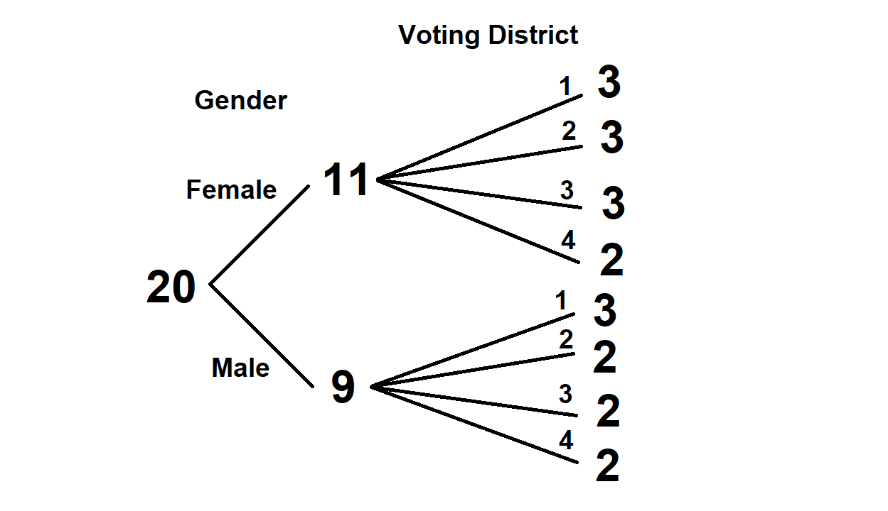
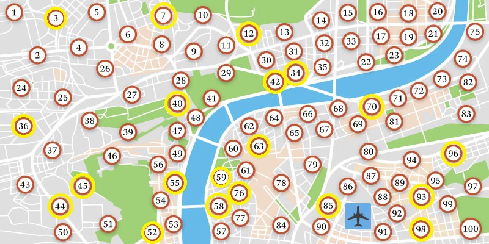

### Rohan Bandaru

## Step 1

There are some assumptions made in this sample

1. Age doesn't play a role in the treatment
2. All patients are of the same sickness level/It doesn't matter


I will use stratified sampling, since there is a lot of diversity among patients and it is important to represent the entire population.

The first strata is gender, as the sickness may affect both genders differently. In the population of 100 patients, there are 54 females and 46 males. Therefore, in my sample of 20, I will choose 11 females and 9 males to maintain the ratio. 

My second strata is voting district, which I'm assuming depends on the patient's location. This way I do not misrepresent a certain part of Hopkinsville. Maybe the patient's environment affects the sickness.

```{r}
districtstrata <- matrix(c(32, 6, 24, 5, 23, 5, 21, 4),ncol=2,byrow=TRUE)
colnames(districtstrata) <- c("   Sick Residents", " |  # People to include in sample")
rownames(districtstrata) <- c("District 1", "District 2", "District 3", "District 4")
districtstrata <- as.table(districtstrata)
districtstrata
```

I found these values by rounding 20 x the proportion of sick residents from a certain district. 

Combining these two strata, I will random sample from the following categories:

```{r}
sample <- matrix(c(3, 2, 2, 2, 3, 3, 3, 2),ncol=4,byrow=TRUE)
colnames(sample) <- c("District 1", "District 2", "District 3", "District 4")
rownames(sample) <- c("Male", "Female")
sample <- as.table(sample)
sample
```
Here is the final sample (patient numbers):
7, 44, 45, 34, 52, 55, 58, 63, 70, 96, 98, 3, 12, 36, 40, 42, 59, 76, 85, 93

Here is a visual representation:


Here are the subjects on the map:


The subjects are fairly spread out across Hopkinsville, and the few clumps and sparsities I'd attribute to the way the voting districts are organized. I could have made my own borders and used them instead of the voting districts, but I think this is still the optimal sample. I have accurately represented the gender and location of the population in my sample. 


## Step 2

1. What are the experimental units? 
A child (3 months to 18 years) with non-severe community acquired pneumonia at a paediatric Emergency Department. 

2. What are the factors? How many levels?
The only factor is Whether or not the patient is given amoxicillin twice or thrice in a day. There are two levels.

3. What are the treatments?
There are two treatments, either taking 2 doses of amoxicillin daily, or taking 3 doses daily. 

4. What experiment design is used? (i.e. Which method from our study is the most similar?) 
They are using a non-blind comparison experiment. 

5. How are randomization, control, comparison, and replication used in the experiment?
Randomization - They are using random assignment to divide the subject between treatments. 
Control - There isn't much control in this experiment as they cannot change much about child's life outside of the Amoxicillin dose. 
Comparison - They have comparison because they are comparing the two treatments of taking it twice or thrice in a day. 
Replication - They plan to use 1370 participants to ensure that the results aren't due to random chance. 

6. What are the possible confounding variables?
Because the study is not blind, the children taking 3 amoxicillin may feel better simply because they are taking more medicine. Also, side effects of Amoxicillin could be more prevalent in the children taking higher doses, causing them to miss school from the drug rather than their sickness. 


## Step 3

To include replication, I made sure to use enough people in the experiment so that the results are not due to chance. As I do not know how each drug works in the population, I made the assumption that for all of the drugs, 20 people is enough to make an inference about the population. For comparison, there will be two treatments/arms, one arm will take the medicine, and the other arm (control group) will take a placebo without the physician knowing which one they are taking, making the experiment double-blind. I will use a block-random design with the blocks being the strata I already created in step 1 combined with random assignment to place the subjects in either treatment. To maximize control, I will make sure that the subjects have similar habits of life (diet, exercise). This experiment allows for inference because I have included all facets of good experimental design, Comparison, Randomization, Replication, and Control.