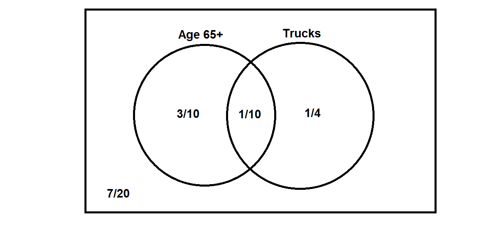
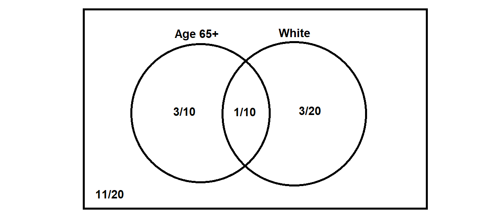

### Rohan Bandaru

## Step 1

Using the given information about hopkinsville, I will allocate certain ranges of numbers to each category as follows:

#####Age:

0 -> Age 24 or younger

1-47 -> Age 25-54

48-71 -> Age 55-64

72-99 -> Age 65+

#####Car Type:

0-30 -> Cars

31-66 -> SUVs

67-99 -> Trucks

#####Color:

0-20 -> White

21-51 -> Silver/Gray

52-70 -> Black

71-80 -> Red

81-99 -> Other

Now, I will choose 3 random numbers from 0-99 for each customer and determine their simulated age, vehicle type and color. 

```{r}
fullsamplelist = list("Sample", "Age Group", "Type", "Color")

agegroup = 0
type = 0
color = 0

Cars = 0
Trucks = 0
SUVs = 0

age24under = 0
age25to54 = 0
age55to64 = 0
age65over = 0

white = 0
silvgray = 0
black = 0
red = 0
other = 0

for (i in 1:20) {
  
  rand1 = floor(runif(1, min=0, max=100))
  if (rand1 == 0) {
    agegroup = "<24"
    age24under = age24under +1
    
  } else if (rand1 <= 47) {
    agegroup = "25-54"
    age25to54 = age25to54 +1
    
  } else if (rand1 <= 71) {
    agegroup = "55-64"
    age55to64 = age55to64 +1
    
  } else if (rand1 <= 99) {
    agegroup = "65+"
    age65over = age65over +1
    
  }
  
  rand2 = floor(runif(1, min=0, max=100))
  if (rand2 <= 30) {
    type = "Car"
    Cars = Cars +1
    
  } else if (rand2 <= 66) {
    type = "SUV"
    SUVs = SUVs +1
    
  } else if (rand2 <= 99) {
    type = "Truck"
    Trucks = Trucks +1
    
  }
  
  rand3 = floor(runif(1, min=0, max=100))
  if (rand3 <= 20) {
    color = "White"
    white = white +1
    
  } else if (rand3 <= 51) {
    color = "Silver/Gray"
    silvgray = silvgray +1
    
  } else if (rand3 <= 70) {
    color = "Black"
    black = black +1
    
  } else if (rand3 <= 80) {
    color = "Red"
    red = red +1
    
  } else if (rand3 <= 99) {
    color = "Other"
    other = other +1
    
  }
  
  fullsamplelist = c(fullsamplelist, c(i, c(agegroup, c(type, color))))
}

asmatrix <- matrix(unlist(fullsamplelist), ncol=4, byrow=TRUE)
colnames(asmatrix) <- c("", "", "", "")
rownames(asmatrix) <- c("", "", "", "", "", "", "", "", "", "", "", "", "", "", "", "", "", "", "", "", "")
as.table(asmatrix)

```

## Step 2

#### Part 1
```{r}
tabledata = c(0, 0, 0, age24under, 2, 1, 3, age25to54, 0, 4, 2, age55to64, 2, 4, 2, age65over, Cars, SUVs, Trucks, 20)
asmatrix <- matrix(tabledata, ncol=4, byrow=TRUE)
colnames(asmatrix) <- c("Cars", "SUVs", "Trucks", "Total")
rownames(asmatrix) <- c("Age 24 or younger", "Age 25-54", "Age 55-64", "Age 65+", "Total")
as.table(asmatrix)
```

A is highest frequeny age which is 65+. B is highest frequency vehicle which is SUVs.

A and B = 1/5

A or B = 13/20

Now A is second highest frequency age which is tied. I will choose 55-64. B is now Trucks. 

A and B = 1/10

A or B = 11/20

#### Part 2
```{r}
tabledata = c(0, 0, 0, 0, 0, age24under, 2, 2, 0, 0, 2, age25to54, 1, 2, 0, 2, 1, age55to64, 2, 2, 1, 1, 2, age65over, white, silvgray, black, red, other, 20)
asmatrix <- matrix(tabledata, ncol=6, byrow=TRUE)
colnames(asmatrix) <- c("White", "Silver/Gray", "Black", "Red", "Other", "Total")
rownames(asmatrix) <- c("Age 24 or younger", "Age 25-54", "Age 55-64", "Age 65+", "Total")
as.table(asmatrix)
```

A is Age 65+, C is Silver/Gray. 

A and C = 1/10
A or C = 3/5

Now A is Age 55-64, C is tied (I chose White).

A and C = 1/20
A or C = 1/2

#### Part 3





## Step 3


B is the event the customer bought an SUV and C is the event that the color (of any purchased vehicle) is Silver/Gray. 

P(B|C) = 1/5 / 3/10 = 2/3

P(C|B) = 4/9

X is the event that the customer bought a Truck and Y is the event that the color is white. 

P(X|Y) = 3/20 / 1/4 = 3/5

P(Y|X) = 3/7

P(B|Y) = 1/20 / 1/4 = 1/5

P(Y|B) = 1/9

P(X|C) = 1/20 / 3/10 = 1/6

Determine if B and C are independent using the rule P(B|C) = P(B|C^c)
From the tree you can see taht they aren't independent but proving it using the rule:
P(B|C) = 2/3
P(B|C^c) = 1/4 / 7/10 = 5/14
2/3 doesn't equal 5/14, so they are not independent

Determine if X and Y are independent using the rule P(X|Y) = P(X)
From the tree you can see that they aren't independent but proving it using the rule:
P(X|Y) = 3/5
P(x) = 7/20
3/5 doesn't equal 7/20, so they are not independent

## Conclusion

One could argue that we need more information to best decide what car to use. Customers may dislike their current model, and want to migrate away from it. Advertising the same style car that they already own may discourage them from an upgrade. That being said, I'll assume that you want to pick a car that is most commonly owned among potential customers. 

From the results above, the best vehicle for the Brand A marketers to use in their commercial is a Silver/Gray SUV. The vehicle color should be Silver/Gray, as it attracts all age demographics (see table). Also, P(X|C)+P(B|C) is greater than P(B|Y)+P(X|Y) showing that it is better than the second best color, white. The vehicle type should be an SUV, as it is the most common vehicle type and P(B|C)+P(B|Y) is greater than P(X|C)+P(X|Y), showing that is better than the second most common vehicle type which is a truck. 
