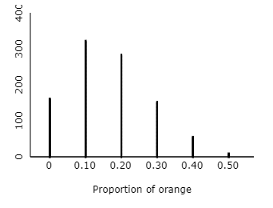

### Rohan Bandaru

## Step 1

Anticipated Population Distribution:
```{r}
hist(c(1, 2, 3, 4, 5, 6), xlab = "Roll", ylab = "Proportion", main = "Dice Rolls", breaks = c(0,1,2,3,4,5,6), freq=FALSE)
```
Samples of 10 die rolls:
```{r}
numbers = 1:6
rolls1 <- sample(x = numbers, size = 10, replace = TRUE)
hist(rolls1, xlab = "Roll", main = "10 Dice Rolls", breaks = c(0,1,2,3,4,5,6))
```
10% of the rolls resulted in 2. p^ is 0.1.
```{r}
rolls2 <- sample(x = numbers, size = 10, replace = TRUE)
hist(rolls2, xlab = "Roll", main = "10 Dice Rolls", breaks = c(0,1,2,3,4,5,6))
```
20% of rolls resulted in 2. p^ is 0.2.

Sampling Distribution Applet:


1. Sampling Distribution of the Sample Proportions would be the best name for this distribution. It is definitely not the the Sampling Distribution, and it's not the Population Distribution. 

2. It is in the shape of a binomial distribution

3. The mean of this distribution is 1.65, which is very close to the population proportion value of ~0.1667. (10 x 0.1667 = 1.667)

4. No this does not surprise me. The proportion of 2's from both of my samples aren't surprising. They are pretty close to 1.6 (0.1 and 0.2).


## Step 2

1. We need a sample size of at least 60 to satisfy the large counts condition, which lets us approximate the sampling distribution as normal. 60 x 1/6 >= 10 and 60 x 5/6 >= 10. I rolled the dice 60 times and got 9 rolls of 2, making the proportion of 2's = 9/60 = 0.15.

2. You can calculate the probability using normalcdf, or you can calculate it using basic probability/binomial formula. 

Using binomial formula: 
P(0.15 proportion of 2s in 60 rolls) = 60C9 x 1/6^9 x 5/6^51 = 0.1343

Using CLT to get normal approximation: The sd of the sample proportion distribution is sqrt(p(1-p)/n) which is sqrt(0.1667 x (1-0.1667) / 60) = 0.0481. The mean is the same as the poplation mean, 0.1667. Since the proportion of 2's is discrete, I will find the bounds to use in the normalcdf() function. lower: 0.14167 = (8/60 + 9/60)/2 and upper: 0.15833 = (9/60 + 10/60)/2

P(0.15 proportion of 2s in 30 rolls) = normalcdf(lower:0.14167,upper:0.15833,mean:0.1667,sd:0.0481) = 0.1296

3. No, these results do not provide any indication that 2 is appearing more than usual. We actually got less than the expected number of 2s, which was 10 2s (proportion of 0.16667). The probability of a perfectly fair dice getting these results is about 0.13, which is fairly low. If anything, this indicates that 2 is not appears as often as it should be. However, because this was only one sample, we cannot really say whether it is or isn't a biased die, and these results are well within the margins of a fair die.


## Step 3

1. The expected average for the values rolled is 3. The population mean is 3 (1/6*(1+2+3+4+5+6)), and the expected average of the sample means is the same as the population mean. 

2. According to the CLT, we need to take a sample of at least 30 in order to approximate our sample means as a normal distribution. I rolled the dice 30 times and found that the average of the values was 3.333. 

3. To find the probability of getting a sample average of 3.333 in a sample size of 30, I can use the normalcdf function. The mean of the sample mean distribution is the same as the population mean, so 3. The sd of the sample means is equal to the population sd divided by the square root of the sample size (n). Sample sd = 1.87/sqrt(30) = 0.3414. Because the mean of a dice sample is discrete, I will calculate the lower and upper bounds. Upper: 101/30=3.36 Lower: 99/30=3.3

P(Average of 3.3333 from 30 rolls of fair die) = normalcdf(lower:3.3,upper:3.36,mean:3,sd:0.3414) = 0.0439

4. No, these results do not indicate that 2 is being rolled more than usual. If anything, they provide evidence that 2 is appearing less often than normal, as the average of the sample of 30 rolls was 3.3333, which is higher than the population mean 3, and has a low chance (4%) of occuring with a fair die. This means that we didn't get as many low numbers as a fair dice theoretically would. However, because this was only one sample, we cannot really say whether it is or isn't a biased die, and these results are well within the margins of a fair die. 


## Conclusion

Based on these results, I think it's fair to assume the teacher was rolling with a fair die. This does not however, mean her method was flawless. She needs to understand that sample proportions can vary, and in her case, the variation was enough such that she ended up with more students than could fit in the parking lot. Assuming the total number of students who signed up was 1200 (6x200), I calculated the probability that 225 would roll a 2. P(0.1875 proportion in a sample of 1200) = 0.0096. This alone is small, but calculating the probability that you go over by any amount, not just 25 yields: 0.469. Thats nearly a 50% chance that she will end up choosing more students than can fit in the parking lot. I think her overall idea was sound, but next time she should use calculations to determine if problems like this have a significant chance of occuring. 