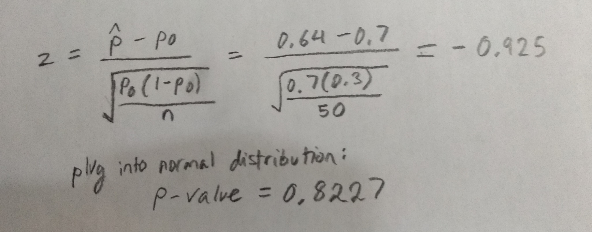
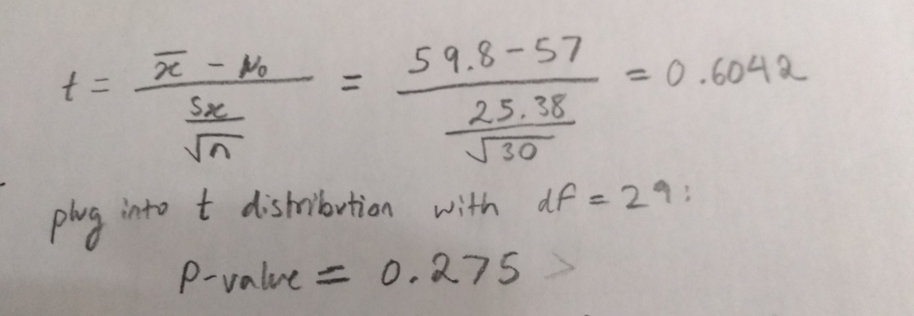

### Rohan Bandaru

## Step 1
### Part 1
I picked 50 random locations and found that 32 were over water and 18 were over land. The sample proportion of ocean = 0.64.
```{r}
locations = c("IIIII IIIII IIIII IIIII IIIII IIIII II", "IIIII IIIII IIIII III")
asmatrix <- matrix(locations, ncol=2, byrow=TRUE)
rownames(asmatrix) <- c("")
colnames(asmatrix) <- c("Ocean", "Land")
as.table(asmatrix)
```

### Part 2
I picked 30 random cities, and got today's (12/27/2020) forcasted high-temperature for each one. 
```{r}
cities = c("Teeli, Russia", "-9", 
           "Ordubad, Azerbaijan", "37", 
           "Bedford, United States", "47", 
           "Athens, United States", "57", 
           "Christchurch, New Zealand", "60", 
           "Iloilo, Philippines", "86", 
           "Yendi, Ghana", "96", 
           "Fountainhead-Orchard Hills, United States", "48",
           "Pinckneyville, United States", "54",
           "Zion, United States", "34",
           "Kaitaia, New Zealand", "69",
           "Tearce, Macedonia", "47",
           "Arnhem, Netherlands", "41",
           "Mogadishu, Somalia", "86",
           "Florence-Graham, United States", "65",
           "Monahans, United States", "74",
           "Ye, Burma", "89",
           "Indio, United States", "69",
           "Country Club Estates, United States", "65",
           "Carnarvon, Australia", "101",
           "Sarpang, Bhutan", "69",
           "Papillion, United States", "36",
           "Bartica, Guyana", "83",
           "Attalla, United States", "55",
           "Binga, Congo (Kinshasa)", "92",
           "Hyattsville, United States", "52",
           "Qaraghandy, Kazakhstan", "9",
           "Waukegan, United States", "38",
           "Montevallo, United States", "55",
           "Sibu, Malaysia", "89"
           )
asmatrix <- matrix(cities, ncol=2, byrow=TRUE)
rownames(asmatrix) <- c("", "", "", "", "", "", "", "", "", "", "", "", "", "", "", "", "", "", "", "", "", "", "", "", "", "", "", "", "", "")
colnames(asmatrix) <- c("City", "Forecasted High Temperature (F)")
as.table(asmatrix)
```


## Step 2

Performing a significance test on the proportion of the Earth's area that Oceans occupy (rising sea levels).

#### State 
I am testing if the proportion of Earth that is covered by water has increased from the null hypothesis of 70%. 

#### Plan 
I will use a one-sample Z test for population proportion. 
The following conditions need to be met:
Random - The data does come from a random sample, as the locations were randomly generated.
10% - There are certainly more than 50*10=500 possible locations on Earth, so the sample is less than 10%
Large Counts - Both the sample size (50) and remaining population size are greater than 10

#### Do

Using the one sample z-test formula, I got z = -0.925, and a P-value of 0.8227. 

#### Conclude
A P-value of 0.8227 is far greater than 0.05, implying that there is no significant rise in Ocean coverage. This was to be expected, as my sample proportion of 0.64 is less than 0.7, resulting in a P value of at least 0.5. So, I fail to reject the null hypothesis of 70%.

#### Error Analysis
A type 1 error would be if I rejcted a true null hypothesis. If the ocean coverage was in fact 0.7 yet I stil  rejected it, this would be a type 1 error. Some possible consequences would be that I am overly worried about rising sea levels, or I accidentally allocate unecessary resources into combatting rising sea levels.

A type 2 error would be if I failed to reject a false null hypothesis. In other words, if the ocean coverage was actually greater than 0.7 but I failed to reject the null hypothesis that it is 0.7, this would be a type 2 error. Possible consequences could be underestimating the magnitude and impact of rising sea levels, as well as failing to prepare for the damages/consequences of rising sea levels.

Based on my results, countries should not be overly concerned about rising sea levels. Global warming is a different issue altogether with many more nuances and effects, however my test indicated that sea levels have not risen past 70%.


## Step 3

Performing a significance test on the surface temperature of the Earth to see if it has risen.

#### State 
I am testing if the average surface temperature of Earth has risen above 57 degrees Farenheight.

#### Plan 
I will use a one-sample T test for population mean. 
The following conditions need to be met:
Random - The data does come from a random sample, as the locations were randomly generated.
10% - There are certainly more than 30*10=300 possible locations on the surface of Earth, so the sample is less than 10% of the total
Normal/Large Sample - The sample size is at least 30, meaning the data can be approximated by a normal distribution.

#### Do
```{r}
print(paste0("Sample mean is: ", mean(as.integer(c(asmatrix[,2])))))
print(paste0("Sample standard deviation is: ", sd(as.integer(c(asmatrix[,2])))))
```

Using the one sample t-test formula, I got t = (sample_mean - null_mean) / (sample_sd / sqrt(n)) = 0.604
Plugging this into a t-distribution of df=29, I got a P value of 0.275.

#### Conclude
A P-value of 0.275 is greater than 0.05, meaning that I failed to reject the null hypothesis, and prove that there has been any significant increase in global average surface temperature.

#### Error Analysis
A type 1 error would be if I rejcted a true null hypothesis. In other words, if the average temperature had not risen from the null hypothesis of 57 degrees yet I still claimed it did, this would be a type 1 error. Some possible consequences would be worrying too much about rising global temperatures and wasting resources trying to combat it.

The probability of commiting a type 1 error is equal to alpha, or the significance level of the test. In my case that is 0.05 or 5%.

A type 2 error would be if I failed to reject a false null hypothesis. In other words, if the average temperature had risen above 57 degrees but I failed to reject the null hypothesis. Possible consequences could be underestimating the magnitude of rising surface temperatures, as well as not preparing enough for consequences. 

The probability of commiting a type 2 error is equal to beta, or 1 - the power of the test. In my case, beta = 0.851

### Verdict
Based on these results, countries should not be overly concerned about rising average surface temperature and rising sea levels. Global warming is a bigger issue with many more nuances and effects, however my tests indicated that the average surace temperature and sea coverage has not significantly risen. However, these tests were very limited. Only sampling 50 locations leads to a standard deviation of root(0.7*0.3/50) or 0.064, which makes it hard to find a result that is statistically significant. If I were to sample more locations, or better yet, use google earth to actually calculate the proportion, I would get a more accurate result. The same thing applies for the surface temperature sample. Only sampling 30 cities leads to a lot of variation and potential bias (only sample one area, only sample inland cities, only sample coastal cities, etc). In addition, this method of randomly choosing cities ignores rural/unpoplated areas, as well as the entire oceans, which account for ~70% of land area and are a large part of Earth's thermal mass. So, given these limitations and the large amount of more convinving evidence, I still think that Global Warming presents a problem to humanity and that we should be preparing for it's effects.
